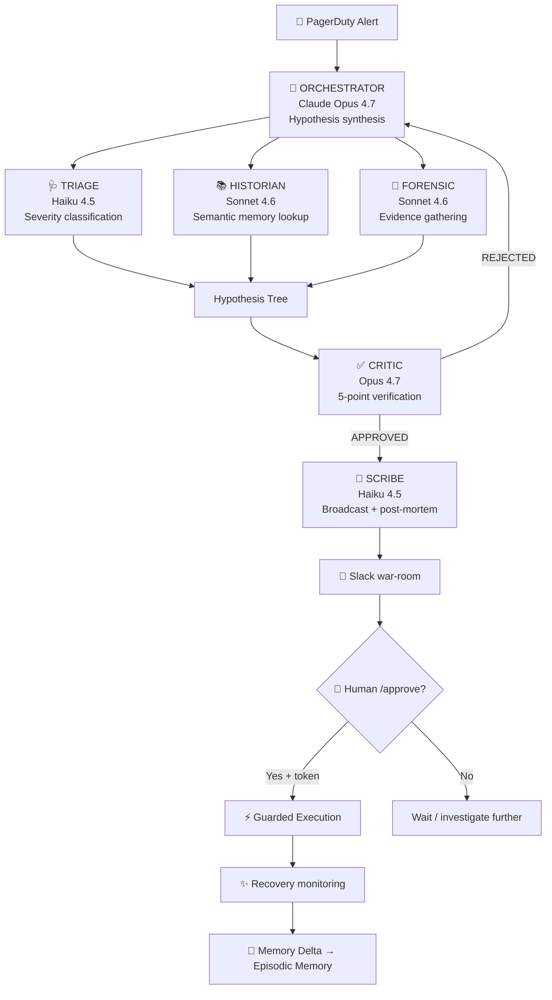
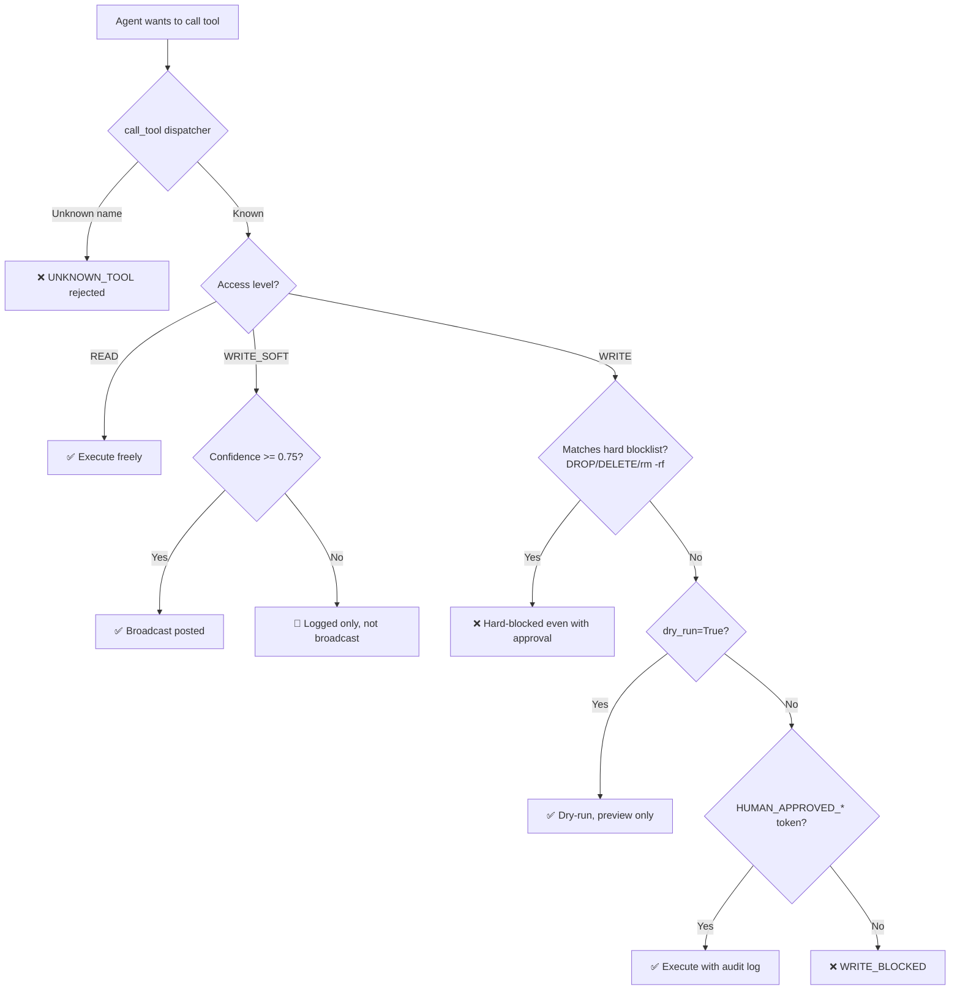
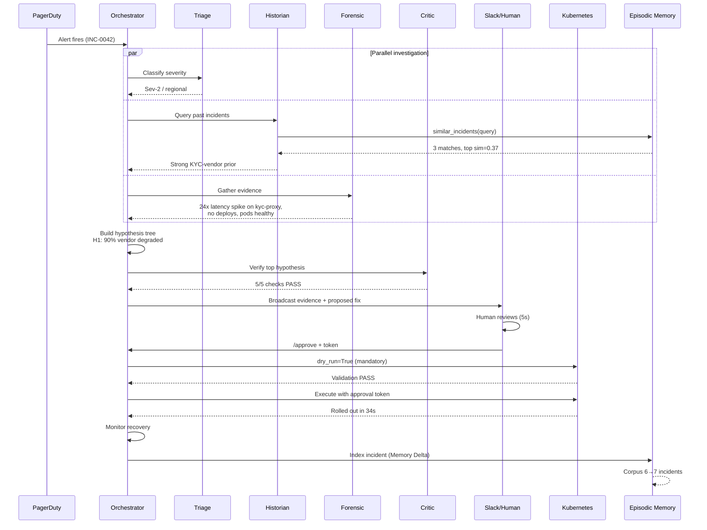

# Sentinel Architecture Diagrams

## 1. Agent Topology (Planner → Workers → Critic)

```mermaid
flowchart TD
    PD[🚨 PagerDuty Alert] --> ORCH
    ORCH[🧠 ORCHESTRATOR<br/>Claude Opus 4.7<br/>Hypothesis synthesis]

    ORCH --> TRIAGE[🩺 TRIAGE<br/>Haiku 4.5<br/>Severity classification]
    ORCH --> HIST[📚 HISTORIAN<br/>Sonnet 4.6<br/>Semantic memory lookup]
    ORCH --> FOR[🔬 FORENSIC<br/>Sonnet 4.6<br/>Evidence gathering]

    TRIAGE --> SYN[Hypothesis Tree]
    HIST --> SYN
    FOR --> SYN

    SYN --> CRITIC[✅ CRITIC<br/>Opus 4.7<br/>5-point verification]

    CRITIC -->|APPROVED| SCRIBE[📝 SCRIBE<br/>Haiku 4.5<br/>Broadcast + post-mortem]
    CRITIC -->|REJECTED| ORCH

    SCRIBE --> SLACK[💬 Slack war-room]
    SLACK --> HUMAN{👤 Human /approve?}
    HUMAN -->|Yes + token| EXEC[⚡ Guarded Execution]
    HUMAN -->|No| WAIT[Wait / investigate further]

    EXEC --> RECOVER[✨ Recovery monitoring]
    RECOVER --> LEARN[🧠 Memory Delta → Episodic Memory]
```

## 2. Three-Tier Memory

```mermaid
flowchart LR
    subgraph Working["Working Memory (per-incident, TTL 24h)"]
        WM1[Observations]
        WM2[Hypothesis tree]
        WM3[Action audit trail]
        WM4[Slack transcript]
    end

    subgraph Episodic["Episodic Memory (vector store)"]
        EM1[Past incident 1]
        EM2[Past incident 2]
        EM3[Past incident N]
        EM4[(TF-IDF index<br/>→ Pinecone in prod)]
    end

    subgraph Semantic["Semantic Memory"]
        SM1[Service dependency graph]
        SM2[Runbooks / SOPs]
        SM3[Ownership registry]
    end

    Working -.->|on resolution| MD[Memory Delta]
    MD -->|index new pattern| Episodic
    Episodic -->|similarity search| Working
    Semantic -->|blast radius lookup| Working
```

## 3. Tool Access Control (Guardrails)

```mermaid
flowchart TD
    AGENT[Agent wants to call tool] --> DISPATCH{call_tool dispatcher}
    DISPATCH -->|Unknown name| BLOCK1[❌ UNKNOWN_TOOL rejected]
    DISPATCH -->|Known| ACCESS{Access level?}

    ACCESS -->|READ| EXECUTE1[✅ Execute freely]
    ACCESS -->|WRITE_SOFT| CONF{Confidence >= 0.75?}
    ACCESS -->|WRITE| BLOCKLIST{Matches hard blocklist?<br/>DROP/DELETE/rm -rf}

    CONF -->|Yes| EXECUTE2[✅ Broadcast posted]
    CONF -->|No| LOG[📝 Logged only, not broadcast]

    BLOCKLIST -->|Yes| BLOCK2[❌ Hard-blocked even with approval]
    BLOCKLIST -->|No| DRYRUN{dry_run=True?}

    DRYRUN -->|Yes| EXECUTE3[✅ Dry-run, preview only]
    DRYRUN -->|No| TOKEN{HUMAN_APPROVED_* token?}

    TOKEN -->|Yes| EXECUTE4[✅ Execute with audit log]
    TOKEN -->|No| BLOCK3[❌ WRITE_BLOCKED]
```

## 4. Workflow — Goal to Resolution

```mermaid
sequenceDiagram
    participant PD as PagerDuty
    participant O as Orchestrator
    participant T as Triage
    participant H as Historian
    participant F as Forensic
    participant C as Critic
    participant S as Slack/Human
    participant K as Kubernetes
    participant M as Episodic Memory

    PD->>O: Alert fires (INC-0042)
    par Parallel investigation
        O->>T: Classify severity
        T-->>O: Sev-2 / regional
    and
        O->>H: Query past incidents
        H->>M: similar_incidents(query)
        M-->>H: 3 matches, top sim=0.37
        H-->>O: Strong KYC-vendor prior
    and
        O->>F: Gather evidence
        F-->>O: 24x latency spike on kyc-proxy,<br/>no deploys, pods healthy
    end

    O->>O: Build hypothesis tree<br/>H1: 90% vendor degraded
    O->>C: Verify top hypothesis
    C-->>O: 5/5 checks PASS

    O->>S: Broadcast evidence + proposed fix
    S->>S: Human reviews (5s)
    S->>O: /approve + token

    O->>K: dry_run=True (mandatory)
    K-->>O: Validation PASS
    O->>K: Execute with approval token
    K-->>O: Rolled out in 34s

    O->>O: Monitor recovery
    O->>M: Index incident (Memory Delta)
    M-->>M: Corpus 6→7 incidents
```
